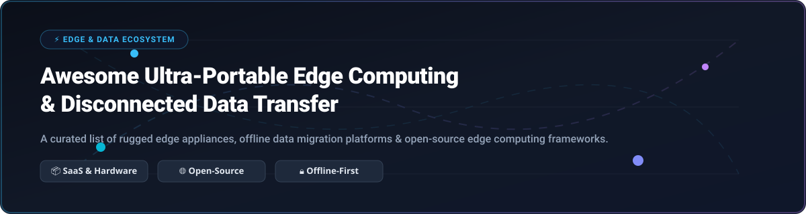

# ⚡ Awesome Ultra-Portable Edge Computing & Data Transfer

  

  
  
  
  
  
  
  

---

## 🌟 Top Ultra-Portable Edge Computing & Data Transfer Ecosystem

> **A Curated List of SaaS Products, Commercial Hardware Devices & Open-Source GitHub Projects**  
> *Focused on Rugged Edge Devices, Offline Data Migration, Tactical Edge AI & Open-Source Edge Orchestration Platforms*

**Last updated: October 2026** 📅

---

## 📌 Table of Contents
- [📖 Overview & Market Analysis](#-overview--market-analysis)
- [🏢 SaaS & Hosted Commercial Platforms](#-saas--hosted-commercial-platforms)
- [💻 Open-Source GitHub Projects](#-open-source-github-projects)
- [🤝 How to Contribute](#-how-to-contribute)
- [💖 Support](#-support)
- [⚠️ Security & Operational Disclaimer](#️-security--operational-disclaimer)
- [⭐ Star History](#--star-history)

---

## 📖 Overview & Market Analysis

This repository tracks notable **commercial edge computing and data transfer devices** and **open-source projects** that bring compute, storage, and AI inference to disconnected, remote, or bandwidth-constrained environments. These tools range from ruggedized transfer appliances (like AWS Snowcone and Azure Data Box Disk) to edge Kubernetes clusters and offline stream processing engines.

### 🌐 Sector Market Size & Structure
> 📈 **Market Size Estimate**: The global Edge Computing and Portable Edge Data Transfer market is valued at approximately **$21.4 Billion in 2026** and is projected to reach **$155 Billion by 2032**, growing at a **CAGR of ~38.9%**.  
> 📊 **Market Structure**: The sector is **Moderately Fragmented**. While cloud hyperscalers (Microsoft, AWS, Google) dominate central cloud data sync and managed edge control planes, hardware innovation and localized edge processing remain highly distributed among specialized hardware OEMs (NVIDIA, Dell, HPE, Lenovo, Advantech) and open-source edge computing software platforms.

---

## 🏢 SaaS & Hosted Commercial Platforms

Below is a comparison of commercial SaaS products, edge devices, and managed platforms. The table is **sorted by Company Size (Revenue / Valuation) in descending order**.

| Product / Platform | Company Size (Valuation / Rev) | Description | Pricing (Starting Tiers) | Free Tier / Free Trial Limits |
| :--- | :--- | :--- | :--- | :--- |
| 🪟 **[Azure Data Box Disk](https://azure.microsoft.com/en-us/products/databox/)** | **~$3.1 Trillion** *(Market Cap / $245B Rev)* | Portable, ruggedized SSD appliances for bulk offline data migration to Azure without bandwidth bottlenecks. | **$50 one-time service fee** per 40 TB order (+ $5/day per disk after 12 days) | **$200 free credit** valid for 30 days + 55+ free Azure services |
| 💚 **[NVIDIA Jetson Edge](https://www.nvidia.com/autonomous-machines/embedded-systems/)** | **~$3.0 Trillion** *(Market Cap / $60B Rev)* | Industry-leading edge AI & robotics computing platform featuring Jetson Orin modules & JetPack SDK. | **$199** for Jetson Orin Nano module (*$499 developer kit*) | **NVIDIA JetPack SDK free** download & 90-day trial for NVIDIA AI Enterprise |
| 🔍 **[Google Distributed Cloud Edge](https://cloud.google.com/distributed-cloud)** | **~$2.1 Trillion** *(Market Cap / $307B Rev)* | Fully managed edge GKE solution running containerized & GPU workloads on Google-managed on-premises hardware. | Starts at **~$1,500/month** per node base subscription | **$300 free credit** valid for 90 days across Google Cloud Platform services |
| 📦 **[AWS Snowcone](https://aws.amazon.com/snowcone/)** | **~$1.9 Trillion** *(Market Cap / $575B Rev)* | Portable, 4.5 lb ruggedized data migration & edge compute device with EC2 & AWS IoT Greengrass support. | **$60 one-time service fee** per job (*8 TB HDD*) / $150 (*14 TB SSD*) + $6/day after 5 days | **AWS Free Tier**: 12 months free access + $200 AWS activation credits |
| 🔌 **[Cisco Catalyst Edge](https://www.cisco.com/)** | **~$200 Billion** *(Market Cap / $57B Rev)* | Industrial edge routers and compute gateways for IoT connectivity, vehicle telemetry, and edge analytics. | Hardware starts at **~$1,200/unit** + Cisco DNA Advantage tier at $350/yr | **Cisco DevNet Sandbox**: Free 30-day cloud lab access & evaluation licenses |
| 💻 **[Dell NativeEdge](https://www.dell.com/)** | **~$80 Billion** *(Market Cap / $88B Rev)* | Edge operations software platform simplifying deployment, lifecycle management, and security of edge devices. | Software subscription starts at **~$35/node/month** (+ PowerEdge hardware from $1,100) | **60-day free proof-of-concept** trial & interactive demo sandbox environment |
| 🖥️ **[HPE Edgeline](https://www.hpe.com/)** | **~$25 Billion** *(Market Cap / $29B Rev)* | Converged edge systems for high-performance industrial IoT, data ingestion, and enterprise edge computing. | HPE Edgeline EL300 system starts at **~$2,400 per unit** | **HPE GreenLake 30-day test drive** & developer evaluation program |
| ⚙️ **[Lenovo ThinkEdge](https://www.lenovo.com/)** | **~$15 Billion** *(Market Cap / $62B Rev)* | Compact, fanless rugged edge servers for AI inference, sensor aggregation, and branch office compute. | ThinkEdge SE30 / SE50 servers start at **~$899 per device** | **30-day Lenovo TruScale Edge evaluation** & trial loaner program |
| 🏭 **[Advantech Edge](https://www.advantech.com/)** | **~$8 Billion** *(Market Cap / $2.1B Rev)* | Industrial-grade IoT edge intelligence gateways and fanless embedded computers for automation. | Industrial Edge Gateways (UNO/ARK series) start at **~$450 per unit** | **WISE-PaaS 90-day free developer account** with 1,000 free platform points |
| ⚖️ **[Scale Computing Platform](https://www.scalecomputing.com/)** | **~$500 Million** *(Valuation / $50M ARR)* | Hyperconverged infrastructure (HCI) software platform engineered for remote branch sites and edge clusters. | SC//HyperCore edge appliance starts at **~$4,500 for a 3-node cluster** | **30-day free interactive software trial** & hands-on virtual lab |

---

## 💻 Open-Source GitHub Projects

Below are top open-source projects for edge computing, lightweight Kubernetes, stream processing, and offline data transfer. Projects are **sorted by GitHub Star Count in descending order**.

### 🚀 Open-Source Projects Leaderboard

| Rank | Project & Repository | GitHub Stars | License | Primary Category | Key Features & Highlights |
| :---: | :--- | :---: | :---: | :--- | :--- |
| **1** | ☸️ **[K3s](https://github.com/k3s-io/k3s)** |  | Apache-2.0 | Lightweight Kubernetes | Fully compliant Kubernetes distribution packaged in a single <70MB binary, optimized for ARM64, IoT devices, and edge nodes. |
| **2** | 📦 **[MicroK8s](https://github.com/canonical/microk8s)** |  | Apache-2.0 | Edge Kubernetes | Canonical's zero-ops, pure upstream Kubernetes snap package for developers, IoT edge gateways, and CI/CD pipelines. |
| **3** | 🌐 **[KubeEdge](https://github.com/kubeedge/kubeedge)** |  | Apache-2.0 | CNCF Edge Orchestration | Extends native Kubernetes to edge devices, supporting MQTT/Modbus protocols and offline autonomous operation during network disconnects. |
| **4** | 🌉 **[OpenYurt](https://github.com/openyurtio/openyurt)** |  | Apache-2.0 | CNCF Edge Management | Converts standard Kubernetes clusters into edge-ready infrastructure with autonomous edge node independence and cloud-edge synergy. |
| **5** | 🛠️ **[Baetyl](https://github.com/baetyl/baetyl)** |  | Apache-2.0 | LF Edge IoT Framework | Seamlessly extends cloud computing, data processing, and microservice capabilities to constrained edge hardware devices. |
| **6** | ⚡ **[LF Edge eKuiper](https://github.com/lf-edge/ekuiper)** |  | Apache-2.0 | Edge Stream Processing | Ultra-lightweight SQL-based streaming data processor running with low memory footprints (<10MB) for real-time IoT edge analysis. |
| **7** | 🏭 **[EdgeX Foundry](https://github.com/edgexfoundry/edgex-go)** |  | Apache-2.0 | Industrial IoT Middleware | Vendor-neutral, open-source interoperability framework providing standard APIs between sensors, industrial equipment, and cloud/edge apps. |
| **8** | 📊 **[IoTSharp](https://github.com/IoTSharp/IoTSharp)** |  | Apache-2.0 | Industrial IoT Platform | Cloud-edge-device IoT platform featuring embedded Modbus/OPC-UA drivers, rule chains, and Tomur local AI runtime for offline GGUF models. |
| **9** | 🔌 **[Akri](https://github.com/project-akri/akri)** |  | Apache-2.0 | K8s Resource Interface | Exposes leaf devices (IP cameras, USB devices, sensors) as Kubernetes resources, enabling dynamic workload scheduling at the edge. |
| **10** | ✈️ **[Skyplane](https://github.com/skyplane-project/skyplane)** |  | MIT | Multi-Cloud Data Transfer | Accelerates bulk object storage data transfers across AWS, Azure, and GCP by up to 110x using custom VM overlays and parallel transfer. |
| **11** | 🔄 **[Simple IoT](https://github.com/simpleiot/simpleiot)** |  | Apache-2.0 | Graph DB & Sync | Dependency-free distributed graph database designed for reliable edge-to-cloud bidirectional data sync over low-bandwidth connection (<100 kb/s). |
| **12** | 🖥️ **[ThingsBoard Edge](https://github.com/thingsboard/thingsboard-edge)** |  | Apache-2.0 | Edge Computing Engine | Brings local rule execution, data filtering, local SCADA dashboards, and automated cloud sync to disconnected industrial edge environments. |
| **13** | 🌁 **[Eclipse fog05](https://github.com/eclipse-fog05/fog05)** |  | EPL-2.0 | Fog Computing Virtualization | Unified compute, storage, and networking virtualization platform managing VMs, containers, and bare-metal processes across fog nodes. |
| **14** | 🧊 **[BWS IceCube](https://github.com/seanpm2001/BWS_IceCube)** |  | Open Specification | Data Appliance Spec | Open specification and architectural blueprint for open-source offline data transfer appliances designed as a privacy-centric AWS Snowball alternative. |

---

## 🤝 How to Contribute

We welcome contributions from the community! To suggest a new open-source repository, commercial device, or update existing data:

1. 🍴 **Fork** this repository.
2. 📝 **Add or edit** entries in `README.md` maintaining table formatting.
3. 🔍 **Verify details**: Include official documentation links, exact pricing, free tier details, or GitHub star counts.
4. 📬 **Open a Pull Request** with a descriptive summary of your additions.

---

## 💖 Support

Thank you for exploring the **Awesome Ultra-Portable Edge Computing & Data Transfer** ecosystem! If you find this curated list helpful for your edge infrastructure, IoT deployments, or research projects, please consider supporting the project:

- ⭐ **Star** this repository to help increase its visibility.
- 🍴 **Fork** and contribute new edge devices or open-source frameworks.
- 📢 **Share** this list with fellow edge architects, developers, and DevOps engineers.
- ☕ **Sponsor / Buy me a coffee**: If you'd like to support ongoing maintenance and curation, visit the [GitHub Sponsor Dashboard](https://github.com/sponsors/ishandutta2007).

  

---

## ⚠️ Security & Operational Disclaimer

- 🔐 **Physical Security**: Edge devices deployed in remote or disconnected locations require physical tamper-resistance, full-disk hardware encryption (AES-256 / TPM 2.0), and secure boot validation.
- 🔋 **Power Constraints**: Ultra-portable devices (such as AWS Snowcone) require dedicated battery packs or external power supplies when operated in field environments.
- 📡 **Connectivity Resilience**: Ensure local caching (e.g., SQLite, SonnetDB, or Simple IoT graph DB) is configured to handle prolonged WAN outages gracefully.

---

##  Star History

---

  <b>Built with ❤️ for Edge Architects, IoT Engineers, and Disconnected Systems Developers.</b>

